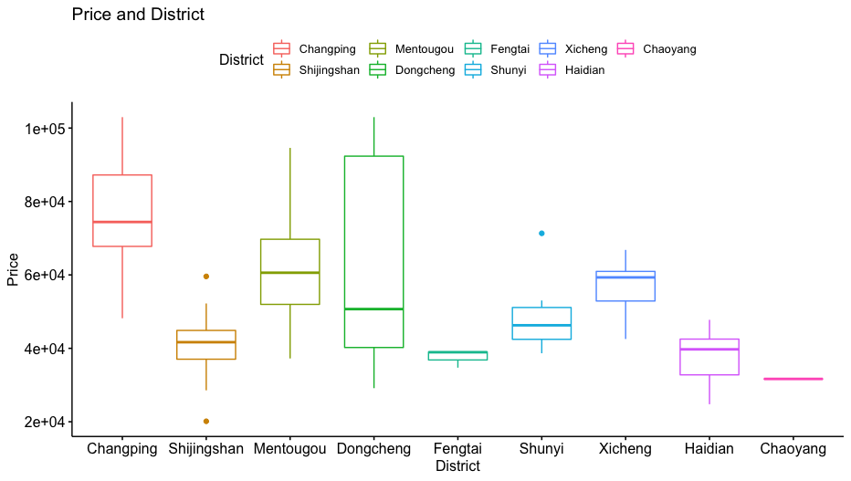
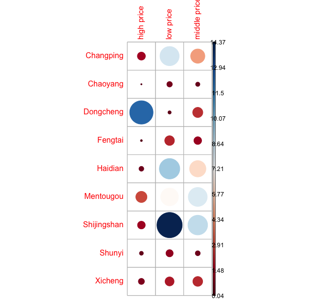
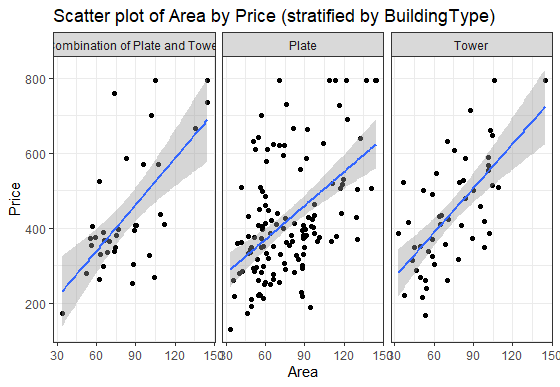
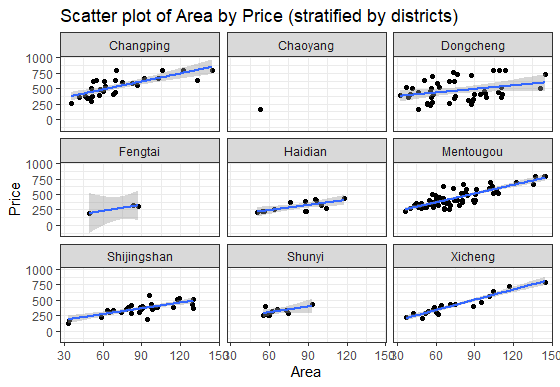

# 📊 Beijing Housing Project Dashboard

## Distribution of Prices by Districts

## Correlation between Building structure and Total Price

## Distribution by Building type and Total Price

## Correlation between Total Price and Area in square meters

## Correlation between Total Price and District

## Scatter Plot of Area by Price stratified by Building Type

## Scatter Plot of Area by Price stratified by District

